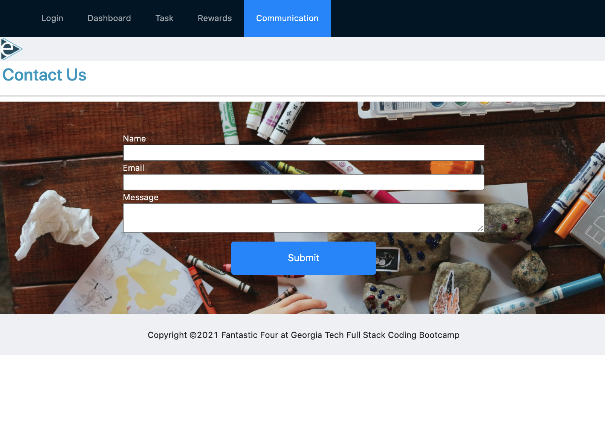

# Token-e-Economy

## Table of Contents

- [Description](#description)

- [Screenshots](#screenshots)

- [Acceptance-Criteria](#Acceptance-Criteria)

- [Installation](#installation)

- [Credits](#credits)

- [Contributing](#contributing)

- [Copyright](#copyright)

## Description

This application was created to provide clinical support for a token economy system. The user registers as either a clinician or a parent. A registered user is able to create, update and delete tasks and rewards. As a child completes a task, he or she receives a token for the amount that the user chooses which is then added to the total token amount displayed on the task and rewards pages. When a child wants to redeem a reward that token amount is then subtracted from the total tokens. Clinician notes are added to each task. The token amount for completed tasks by each user is is displayed in the chart on the dashboard page. The communication page allows for the parent user to be able to send an email to the clinician. 

## Screenshots




## Acceptance-Criteria

```md
Must be backed by a database

Must have CRUD routes for at least one model

Must be deployed using Heroku 

Must utilize at least two new libraries, packages, or technologies that we haven't discussed

Must have a polished front end/UI - NOT Bootstrap

Must have a folder structure that meets the MVC paradigm


Must meet good-quality coding standards (indentation, scoping, naming, etc.)

Must protect API keys and sensitive information
```

## Installation

To access this project you will need to visit our GitHub page and the "Token-e-Economy" repository. After the repository is cloned/forked you can make edits to the project in your repository. Any questions should be directed to [Irene Asay](), [Brian Hayes](bhayes81@gmail.com), [Diego Cortes](), or [David Brown](mailto:gatech55@gmail.com). The official project can be found here: [final-project](https://github.com/diegocortes4/Token-e-Economy). The Heroku site can be found here: [Token-e-Economy](https://token-e-economy.herokuapp.com/).

## Credits

© 2019 Trilogy Education Services, a 2U, Inc. brand. All Rights Reserved.

Technology 1
[react-chartjs-2](https://www.npmjs.com/package/react-chartjs-2)

Technology 2
[jsonwebtoken](https://www.npmjs.com/package/jsonwebtoken)

## Contributing

| **Contributor** |
[David Brown](https://github.com/GaTech55)|
[Brian Hayes](https://github.com/bhayes11)|
[Irene Asay](https://github.com/IreneAsay)|
[Diego Cortes](https://github.com/diegocortes4)|

## Copyright

Copyright ©2021 Fantastic Four.
